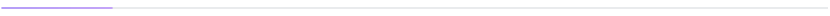

<!-- All SVGs in assets/ are generated by scripts/build_svgs.py — edit the script, not the files. -->

<picture>
  <source media="(prefers-color-scheme: dark)" srcset="assets/hero-dark.svg">
  
</picture>

<samp>
<!-- TODO: point portfolio at your site once it's live -->
<b>portfolio</b>&nbsp; — &nbsp;<a href="https://github.com/Manasvi-247?tab=repositories">github.com/Manasvi-247</a> 
<b>linkedin</b>&nbsp; — &nbsp;<a href="https://www.linkedin.com/in/manasvi-sabbarwal24">@manasvi-sabbarwal24</a> 
<b>email</b>&nbsp; — &nbsp;<a href="mailto:manasvi.sabbarwal@gmail.com">manasvi.sabbarwal@gmail.com</a>
</samp>

 

<picture>
  <source media="(prefers-color-scheme: dark)" srcset="https://raw.githubusercontent.com/Manasvi-247/Manasvi-247/output/github-snake-dark.svg">
  
</picture>

<picture>
  <source media="(prefers-color-scheme: dark)" srcset="assets/divider-dark.svg">
  
</picture>
