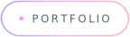
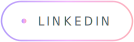
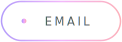

<!-- All SVGs in assets/ are generated by scripts/build_svgs.py — edit the script, not the files. -->

<picture>
  <source media="(prefers-color-scheme: dark)" srcset="assets/hero-dark.svg">
  
</picture>

<!-- TODO: point the portfolio pill at your site once it's live -->
<a href="https://github.com/Manasvi-247?tab=repositories">
  <picture>
    <source media="(prefers-color-scheme: dark)" srcset="assets/pill-portfolio-dark.svg">
    
  </picture>
</a>
&nbsp;
<!-- TODO: confirm this is your LinkedIn handle -->
<a href="https://www.linkedin.com/in/manasvi-sabbarwal">
  <picture>
    <source media="(prefers-color-scheme: dark)" srcset="assets/pill-linkedin-dark.svg">
    
  </picture>
</a>
&nbsp;
<a href="mailto:manasvi.sabbarwal@gmail.com">
  <picture>
    <source media="(prefers-color-scheme: dark)" srcset="assets/pill-email-dark.svg">
    
  </picture>
</a>

 

<picture>
  <source media="(prefers-color-scheme: dark)" srcset="assets/divider-dark.svg">
  
</picture>

### <samp>// activity</samp>

<picture>
  <source media="(prefers-color-scheme: dark)" srcset="https://github-readme-activity-graph.vercel.app/graph?username=Manasvi-247&bg_color=0d1117&color=8b949e&line=a78bfa&point=f0abfc&area=true&area_color=a78bfa&hide_border=true&hide_title=true">
  
</picture>

<picture>
  <source media="(prefers-color-scheme: dark)" srcset="https://raw.githubusercontent.com/Manasvi-247/Manasvi-247/output/github-snake-dark.svg">
  
</picture>

<picture>
  <source media="(prefers-color-scheme: dark)" srcset="assets/divider-dark.svg">
  
</picture>

<samp>
<a href="https://github.com/Manasvi-247?tab=repositories">portfolio</a>
&nbsp;·&nbsp;
<a href="https://www.linkedin.com/in/manasvi-sabbarwal">linkedin</a>
&nbsp;·&nbsp;
<a href="mailto:manasvi.sabbarwal@gmail.com">manasvi.sabbarwal@gmail.com</a>
</samp>

  

<samp>hand-built · raw svg + smil animation · no profile template involved</samp>

